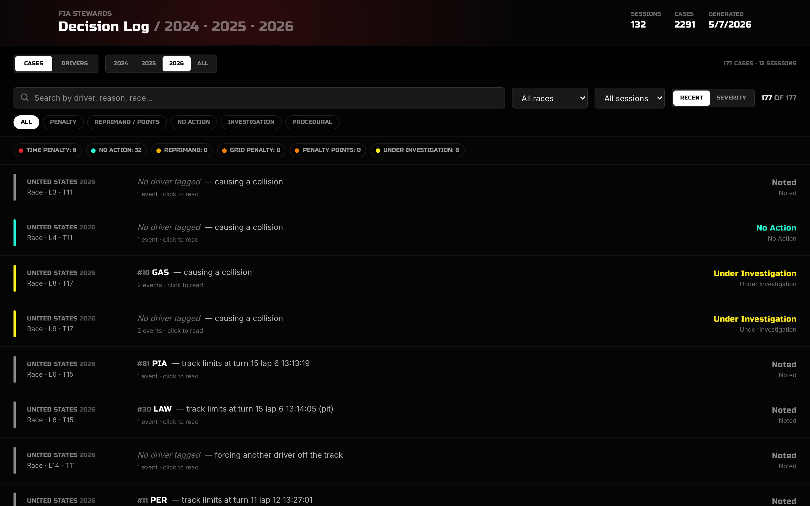

# F1 Stewards: Decision Log


A searchable database of FIA Formula 1 stewards' decisions and race-control incidents,
reconstructed from live broadcast messages across the 2024, 2025, and 2026 seasons. The
current dataset holds **2,291 cases over 132 sessions**, each grouping the messages from an
incident into one case with drivers, reason, location, timeline, and final outcome.



## Features

- **Case list.** Browse every case with search across driver, car number, reason, country,
  and race name, plus filters by outcome type (penalty, reprimand, no action, investigation,
  procedural), country, and session (qualifying, race, sprint), sorted by recency or severity.
- **Case detail.** A modal with the full message timeline, the drivers and car numbers
  involved, lap and turn, the outcome and its detail (seconds, grid places, penalty points),
  and a link out to the official FIA decision documents. `Esc` to close.
- **Drivers view.** A card grid aggregating each driver's stewards history: total cases,
  penalties, penalty seconds / points / grid places, and most-cited reasons. Sort by any of
  those, then open a drawer for the full breakdown and recent cases.
- **Year filter** across 2024 / 2025 / 2026 with a live case and session counter.

## How it works

**Data pipeline (`scripts/fetch.mjs`).** Race-control broadcast messages are fetched from the
[OpenF1 API](https://openf1.org) (rate-limited with a token bucket), filtered by keyword
(`INCIDENT`, `PENALTY`, `STEWARDS`, `TRACK LIMITS`, and so on), then grouped into cases by
`(driver, lap, reason)` so the initial report, the investigation, and the final decision
collapse into one coherent record. The result is baked into `public/incidents.json`.

**Aggregation and ranking (`app/lib/incidents.ts`).** The app flattens cases into rows,
computes per-driver aggregates (penalty totals, top reasons, years active, recent history),
and ranks cases by an outcome-severity order (black flag > stop-and-go > time penalty > grid
penalty > reprimand > no action) for sorting.

**Rendering split.** The page is a server component that loads the JSON and renders header
stats; all filtering, sorting, and navigation happen client-side with no refetch.

## Tech stack

- **Next.js 16 (App Router) + React 19 + TypeScript**, server and client components
- **Tailwind CSS v4**
- **OpenF1 API** for race-control messages (baked into `public/incidents.json`)
- No database and no runtime API calls: the baked JSON is the source of truth

## Run it

```bash
npm install
npm run build && npm start     # open http://localhost:3000
```

To regenerate the data:

```bash
node scripts/fetch.mjs              # all seasons
node scripts/fetch.mjs --years=2024 # a single year
```

> This project uses a customized Next.js whose dev server (`npm run dev`) has a broken
> hot-reload socket. Use `npm run build && npm start` to run it.

## Project layout

```
app/
  page.tsx                 # server component: loads incidents.json + header stats
  components/
    Shell.tsx              # cases/drivers nav, year filter, counters
    CaseList.tsx           # case list with search, filters, sort
    CaseDetail.tsx         # case modal: timeline, outcome, FIA source link
    DriversView.tsx        # driver cards + per-driver drawer
  lib/
    incidents.ts           # types, outcome colours, aggregation, severity ranking
scripts/
  fetch.mjs                # OpenF1 race-control fetcher + case grouping
public/
  incidents.json           # 2,291 cases across 132 sessions (2024-2026)
```

## Notes

- Cases are reconstructed from public race-control broadcast messages, not scraped from the
  official PDFs; the case detail links out to `fia.com` for the authoritative decision.
- The dataset is a point-in-time bake; rerun `scripts/fetch.mjs` to refresh it.
